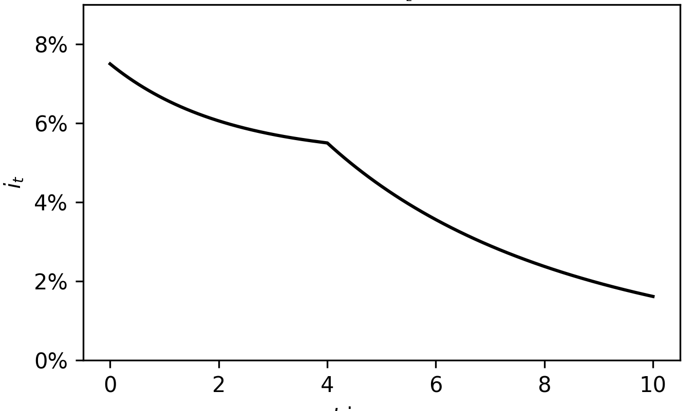
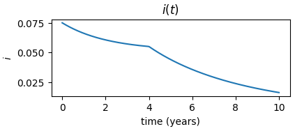

---
title: "Newton "
description: >
  Newton - token for staking and securing the network
---

## Newton overview

Newton is the native staking instrument of Autonity. Its primary function is staking the network, and it is the [stake token](/glossary/#stake-token) used in Autonity's [Proof-of-Stake](/glossary/#proof-of-stake-pos) consensus mechanism. Newton is divisible up to 18 decimal places (the smallest unit is 10^-18 or 0.000000000000000001). The symbol of _Newton_ is `NTN`.

A newton stake token can be in one of three states:

- _unbonded_, the default state in which it is transferrable by the stake holder.
- _bonded_, the bound state in which the Newton has been bonded to a validator. On bonding the Newton token is burned; the bonded stake amount of the validator is increased by the bonded amount.
- _unbonding_, the intermediate state between _bonded_ and _unbonded_. The unbonding Newton is represented as shares in the validator's unbonding pool. Once unbonding has completed, the due amount of Newton is redeemed by minting Newton in an `unbonded` state to the stake holder.

Newton is bonded by the owner staking the token to a [validator](/glossary/#validator) in a bonding operation. If the validator account belongs to the owner, then the newton is [self-bonded](/glossary/#self-bonded), otherwise the token is [delegated](/glossary/#delegated). The total amount of stake bonded to a validator determines its [voting power](/glossary/#voting-power). Total and self-bonded stake amounts are tracked in the validator's state on chain (see [`getValidator()`](/reference/api/aut/#getvalidator)). The bonded token may earn [staking rewards](/glossary/#staking-rewards) if the validator is in the [consensus committee](/glossary/#consensus-committee), payable in [auton](/concepts/protocol-assets/auton/) at the end of the block epoch. 

Newton is unbonded by the staker in an unbonding operation. Unbonded tokens are subject to an unbonding delay, at the end of which Newton is minted to the owner's account.

As Newton is bonded and redeemed [Liquid Newton](/concepts/protocol-assets/liquid-newton/) is minted and burned to the staker's account for [delegated](/glossary/#delegated) stake per Autonity's [liquid staking](/concepts/staking/#liquid-staking) model.

## Total supply and newton inflation

The total supply of Newton will be set to 100 million NTNs. 40% of the total supply is set aside as an "inflation reserve" for [inflation rewards](/glossary/#inflation-rewards) released into circulation over the short-to-medium term. Inflation rewards are emitted in the form of newton inflation, i.e. newly minted newton supply, for bonded stake [participating](/glossary/#participation-rate) in securing the [Autonity network](/glossary/#autonity-network). The quantity of newton emissions declines (in average) over time and asymptotically approaches zero.

Inflation emissions to stakers and validators are crucial for incentivizing network security, ensuring that those contributing to the Newton [participation rate](/glossary/#participation-rate) are adequately rewarded for securing the blockchain. Newton inflation subsidizes the cost and risk of staking during the early stages of the network when transactional activity is low and Auton [staking rewards](/glossary/#staking-rewards) earned from transaction fees alone may not incentivize a sufficiently high staking participation rate. Inflation rewards also help decentralize the network by encouraging a broader base of Newton [stakeholders](/glossary/#stakeholder) to stake their tokens, reducing the risk of centralization. Additionally, these rewards can provide a predictable economic model, attracting long-term investment and commitment from the community.

Autonity’s inflation mechanism is a carefully crafted deterministic emission schedule that is determined based on the number of circulating tokens, irrespective of how many tokens are staked or not. This means that inflation yield for stake [delegations](/glossary/#delegation) is directly impacted by the [participation rate](/glossary/#participation-rate) (i.e. the ratio of staked to non-staked Newton), encouraging staking until a market determined acceptable yield is achieved.

A total of 40 million NTNs will be set aside for inflation rewards from a total supply of 100 million NTNs, ensuring a significant amount of value accrual to stakers over the lifetime of Autonity. NTN inflation rewards are minted and distributed to stakers at the end of each epoch. On emission the newton inflation reward is  [automatically bonded](/glossary/#autobond) by the protocol to the validator nodes where participating Newton is staked. The bonded stake balances of the individual stake delegators (i.e. for [delegated](/glossary/#delegated) and [self-bonded](/glossary/#self-bonded) stake) is incremented accordingly to reflect the inflation received.

::: {.callout-note title="Note" collapse="false"}

Note that Liquid Newton is not minted for stake delegations bonded by [autobonding](/glossary/#autobond) of 
[Newton inflation](/concepts/protocol-assets/newton/#total-supply-and-newton-inflation) emissions.

:::

The exact parameters of the Mainnet inflation mechanism will be determined through active engagement with the community, but the overall curve will follow a slow decrease in inflation from genesis until $\sim~Month~36$, after which the inflation emissions will decay asymptotically to zero far into the future. This can best be summarised by an example curve, as seen below.

Please note that in the graph above, the y-axis percentage returns assume a 100% [participation rate](/glossary/#participation-rate) (i.e. all tokens are staked). To model for yourself the expected inflation yield, divide the
value on the y-axis by an estimated participation rate (e.g. 0.7 for an expected participation rate of 70%, resulting in an inflation yield of 14.3% at genesis for an inflation rate of 10%).

For the [Piccadilly Circus Games Competition ](https://game.autonity.org/) and the [Autonity Piccadilly Tiber Challenge](https://github.com/autonity/tiber-challenge) on the [Piccadilly Testnet](/networks/testnet-piccadilly/), a slightly different inflation schedule has been used to aid in testing. The PCGC Round 6 emission schedule can be seen below:

